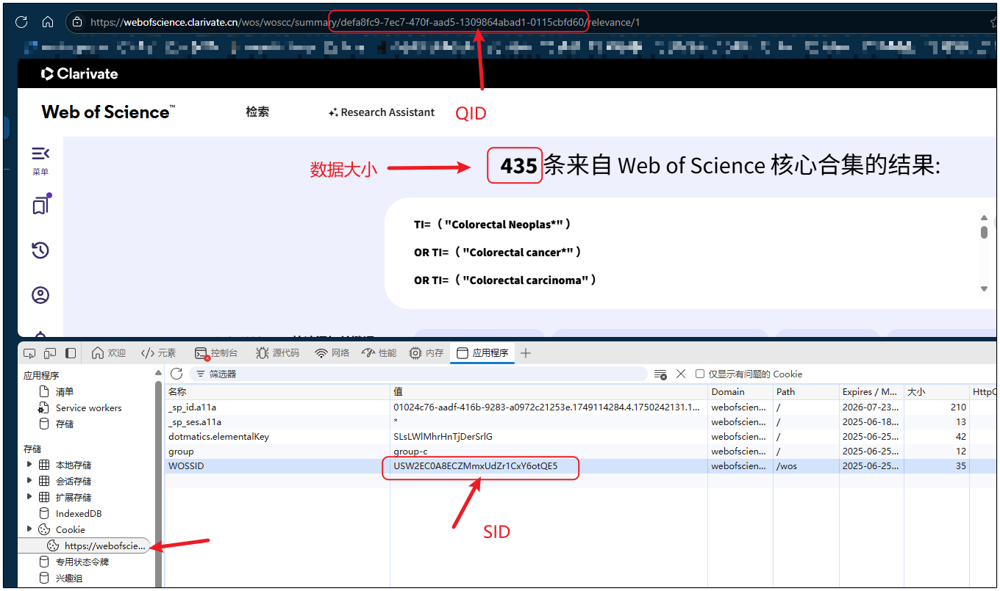
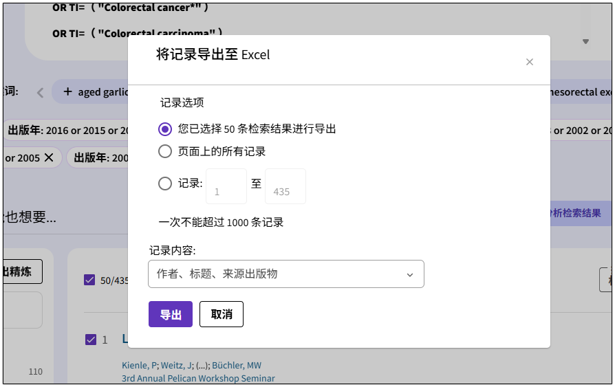

# WOS下载器

## 在网页获取参数

## 参数解释

1. QID是网站
   `https://webofscience.clarivate.cn/wos/woscc/summary/defa8fc9-7ec7-470f-aad5-1309864abad1-0115cbfd60/relevance/1`
   中间的那串数值`defa8fc9-7ec7-470f-aad5-1309864abad1-0115cbfd60`
2. SID是Cookie里面的WOSSID值`USW2EC0A8ECZMmxUdZr1CxY6otQE5`
3. 数据大小就是`435`

## 注意

每一个SID只能使用10次，如果到达10次，界面就会变红。
去官网需要手动点击导出即可。导出之后SID又可以使用10次。
